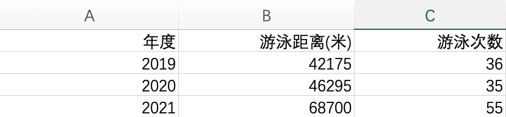

以铜为鉴 可以正衣冠
以人为鉴 可以明得失
以史为鉴 可以知兴替

## 年度总结

### 家庭方面
-	今年最重要的事情，莫过于我的小牛妹妹出生了，多亏了全家人尤其是老婆的努力，给我带来一个 好，心怀感恩。
-	屏山的房子在父亲的操办下装修好了，在年中也让爷爷奶奶顺利入住，可惜产权证目前还未办下来，希望可以在明年`3`月份之前搞定。
-	邵武的房子也简单装修好了，父亲在邵武呆了俩月，风餐露宿非常辛苦，希望后续可以出租出去回点血。
-	暑假给儿子报了个篮球训练营，上到现在快`70`节课了，看的出来在篮球方面还是挺有天赋，希望在这条路上可以走远一些。
-	今年家庭财务方面依旧稳扎稳打，没有较大的支出和浪费，投资方面先后投资了`新能源`，`半导体` 等混合基金，由于整个过程中不时会碰到突然要用钱，好基金在手里也没能拿住，收益大概`16`个点，勉强够上及格线。

### 个人方面

#### 健身
- 今年通过对`罗志祥`老师的时间管理深入学习，解锁了中午去游泳的新技能，中午下班去游个泳，完事后去`711`里买点吃的赶到公司，泳池没什么人，锻炼了身体且不耽误下午上班，不耽误非工作时间陪娃，一箭三雕。

- 通过 `Apple Watch` 的导出功能，统计出今年一共游了`68.7`公里，一共游了 `55` 次：
  
  另外今年还较好的解锁了自由泳前翻滚转身技能，以及勉强可以看的蝶泳技能。

#### 事业
-	职场
	-	依旧低调，工作中没什么大失误，虽然稳占一席之地但是也没什么向上走的前景，考虑到个人性格如此，而且心不在这方面，聊以自慰。
-	技术栈：
	-	[FastAPI](https://fastapi.tiangolo.com/) 
	-	简单过了下[ROS](https://www.ros.org/)，目前还停留在模拟器环节。
	-	简单了解了下 [Hadoop](https://hadoop.apache.org/), 后续也基本没机会用到，当做扩充知识面。

## 来年计划
- 争取一切可能让儿子上心目中理想的小学。
- 不熬夜或者少熬夜。睡觉都睡不好谈何成就大业?
- 全年游泳距离突破 `100` 公里，在自由泳成绩上可以有较大提升，熟练掌握蝶泳技能。
- 争取投资收益上`30` 个点。
- 职场上继续扎根，没有大突破的话那就守好自己的一亩三分地认真经营。
- 捡起丢掉`5`年多的 `C/C++`。另外在爬虫方面稍微提升点技术含量，对`JS`解密方面可以有一点入门。 
- 跟踪`GitHub Trending`，可以找到一些方向来形成自己的产品。
- 熟练掌握 `ELK`。

