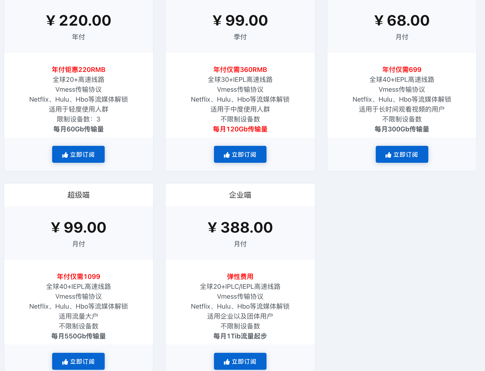
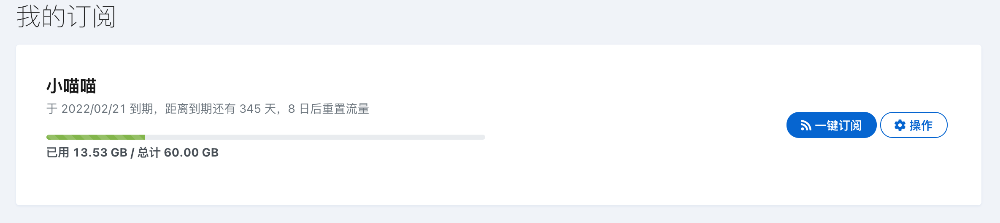
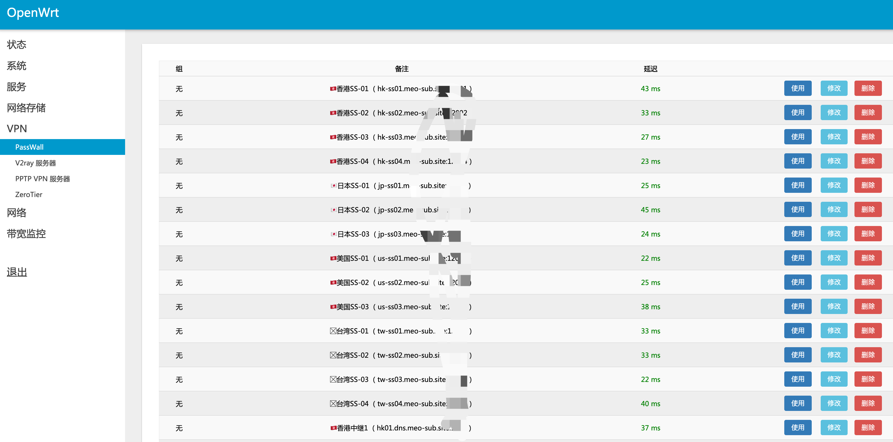
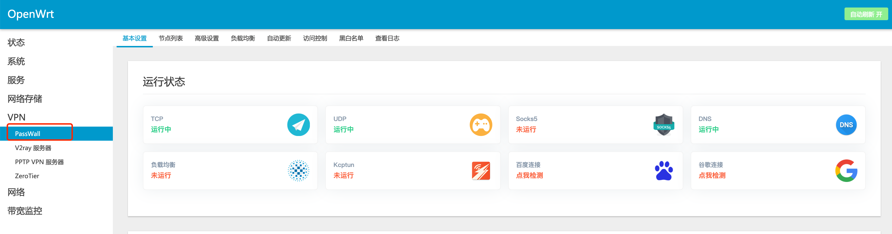
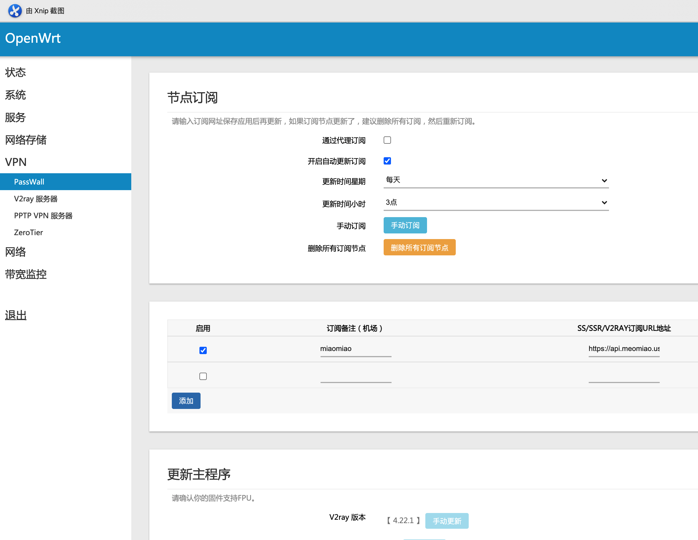
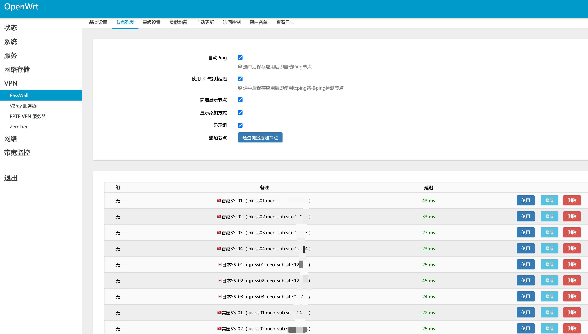

## PS3+N1+梯子组合实现家庭内观看全球新闻直播

### 家用个人梯子
近两年我使用的梯子都是通过薅 [GCP](cloud.google.com)或者 [AWS](aws.amazon.com) 的`VPS`主机来搭建[个人梯子](./Set up the ladder.md),协议从最早的 `SS` 到 `SSR` 再到 `VMess`还有`Trojan` ,平时在公司内通过这些自建梯子访问被墙站点也还算流畅，但是回到家里后梯子就开始各种抽风，经过对路由线路的追踪，发现在公司梯子状况良好的原因是信息技术部门在内网针对这些国外梯子IP走移动或者联通的线路，而在家里走的是电信线路，使用`traceroute` 可以看到`IP` 报文走到一些 `163`骨干网络后就没有下文了，看来是电信做了限制。

### 购买机场
既然自建梯子不好用，就想着购买一些现成的机场服务，经过同事介绍，选择了 [喵喵加速](https://v2ray.life/#/register?code=SCYvm46H)的机场服务，资费信息如下：

我选择的是年付 220元的套餐，每个月60GB，支持两个客户端同时在线，购买前还有点由于每个月才60G是否不够用，经过半个月的使用后发现绰绰有余：

机场内的飞机速度也还可以，通过`OpenWrt`的插件导入订阅链接后，各个飞机的性能信息如下，可以看到延迟都非常的低：

### 将 N1 刷机成旁路由
我手上有两个 `N1`，一个刷成 `Coreelec` 放在客厅当`4K`播放器，另外就刷了 `Armbian`，然后装上 `Docker` 后使用 `OpenWrt`，详细教程可以参考 [私人云搭建 篇六：N1刷armbian并docker设置旁路由openwrt，以及本人家庭网络布局](https://post.smzdm.com/p/akm7q5xk/)。

### 机场订阅信息导入旁路由
刷机后 `OpenWrt` 中自带 `PassWall`插件：

，可以导入我们上面的机场订阅信息:

做完这一切之后，我们的`N1`旁路由就有了跨墙能力，只要把客户端设备的网关和`DNS`指向旁路由的地址，客户端设备就可以愉快的跨墙了。

### PS3的设置
我的客厅有一台`PS3`还在服役，除了平时有空打打我最爱的`战神`系列外,`PS3`还原生支持`YouTube`，`Twitch`等等。在 `PS3`网络设置中将网关地址与`DNS`指向 `N1`旁路由就可以了。

### 最终效果
未完待续。
