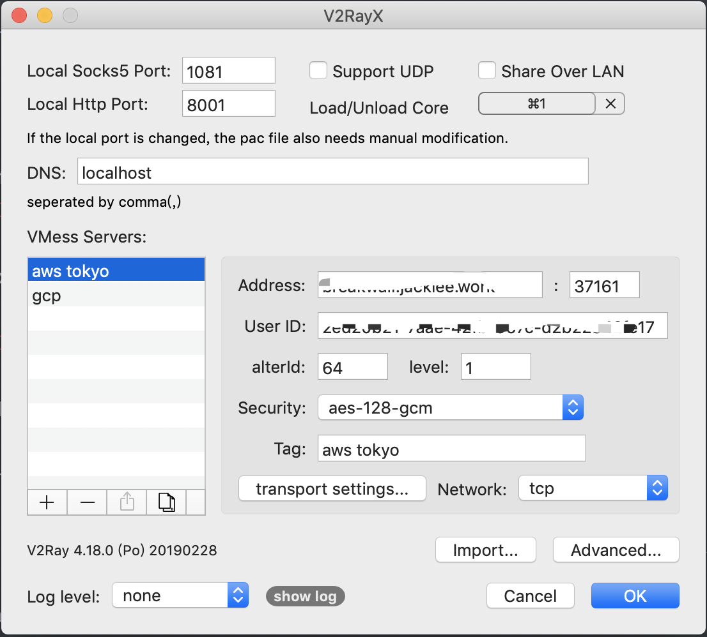

# Set up the ladder

## Install v[two]ray on linux server

```shell
sudo su

bash <(curl -L -s https://install.direct/go.sh)
```

The script installs the following files.

- `/usr/bin/v[two]ray/v[two]ray`: v[two]ray executable
- `/usr/bin/v[two]ray/v[two]ctl`: Utility
- `/etc/v[two]ray/config.json`: Config file
- `/usr/bin/v[two]ray/geoip.dat`: IP data file
- `/usr/bin/v[two]ray/geosite.dat`: domain data file

This script also configures v[two]ray to run as service, if systemd is available.

After installation, we will need to:

1. Update `/etc/v[two]ray/config.json` file for your own scenario.
2. Run `service v[two]ray start` command to start v[two]ray.
3. Optionally run `service v[two]ray start|stop|status|reload|restart|force-reload` to control v[two]ray service.

## Configuration the v[two]ray

```shell
sudo vi /etc/v[two]ray/config.json
```

### modify listening port


### add client uuid


- Each client user uses one line of configuration markup.

- you can copy the following content and modiy your own uuid and name:
	
	- {"id": "xxxxxxx-xxxx-xxxx-xxxx-xxxxxxxxxxxx","level": 1,"alterId": 64,"name": "xxxx"}
	
- uuid can generate from [uuid generator](https://www.uuidgenerator.net/)
		
## use v[two]ray on mac osx

### download

download from [V2RayX](https://github.com/jackleeforce/V2RayX/releases)

### configuration




