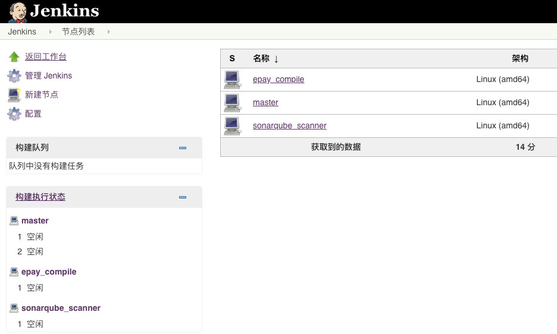

#  jenkins 声明式pipeline调用远程Docker执行任务

## 调用远程服务器执行任务的好处

- 一些 CPU 密集计算型任务，比如编译，静态扫描等等，放在单独的服务器上执行，不会对 Jenkins 所在服务器造成性能负担。
- 通过配置多台同样标签的子节点服务器，可以将多个任务分配到这些子节点上并行处理。

## 将任务执行环境采用 docker 部署而不是直接安装的好处

- [什么是 Docker ？容器对应用程序的好处](https://www.ibm.com/developerworks/community/blogs/3302cc3b-074e-44da-90b1-5055f1dc0d9c/entry/what-is-docker-containers?lang=en)
- [Docker 有什么优势](https://www.zhihu.com/question/22871084)

## Jenkins 配置任务在远程服务器 Docker 容器中执行

### 1. 配置 Jenkins 子节点
- [Step by step guide to set up master and slave machines](https://wiki.jenkins.io/pages/viewpage.action?pageId=75893612)

配置完后效果如下图，这里我配置了两台 Slave 节点：epay_compile 和 sonarqube_scanner。分别用来做编译和sonarqube 代码静态扫描


我们使用 sonarqube_scanner 这台服务器做演示，注意这台服务器的标签: sonarqube ,后续我们将使用这个标签。


### 2. 远程服务器上镜像构建

```Dockerfile
FROM ubuntu:16.04

MAINTAINER jacklee <jackleeforce@gmail.com>

RUN apt-get update -qq \
  && apt-get install -y cppcheck unzip wget \
  && apt-get clean \
  && wget https://binaries.sonarsource.com/Distribution/sonar-scanner-cli/sonar-scanner-cli-4.0.0.1744-linux.zip -O sonarqube-scanner.zip \
  && unzip sonarqube-scanner.zip \
  && mv sonar-scanner-4.0.0.1744-linux sonarqube-scanner \
  && rm sonarqube-scanner.zip

ENV PATH=/sonarqube-scanner/bin:$PATH
```

- 我们在ubuntu 16.04的基础上构建了一个安装好 [cppcheck](http://cppcheck.sourceforge.net/)和[sonarqube-scanner](https://docs.sonarqube.org/latest/analysis/scan/sonarscanner/)的镜像，以后只要启动这个镜像的容器，就可以使用  [cppcheck](http://cppcheck.sourceforge.net/)和 [sonarqube-scanner](https://docs.sonarqube.org/latest/analysis/scan/sonarscanner/) 这两个工具。

执行如下命令，构建镜像:

```shell
docker build -t sonarqube-scanner:latest .
```

- 经过上面的步骤后，我们在 sonarqube_scanner 这个子节点服务器上有了一个标签为 sonarqube-scanner 的 docker 镜像。

### 3. pipeline 配置

```pipeline
stage('code quality check') {
                    agent { 
                        docker {
                            image 'sonarqube-scanner'
                            label 'sonarqube' 
                        }
                    } 
                    steps {
                        sh 'cppcheck --enable=all --xml-version=2 . 2> test.sonarqube.report.xml'
                        withSonarQubeEnv('cell_sonarqube') {
                            sh "sonar-scanner -Dsonar.projectKey=${在sonarqube上创建的项目key} \
                            -Dsonar.sources=. -Dsonar.host.url=$(你的sonarqube URL) -Dsonar.login=${在sonarqube上创建的项目token}"
                        }
                        timeout(time: 10, unit: 'MINUTES') {
                            waitForQualityGate abortPipeline: true
                        }
                    }
                }
```

- 可以看到，要在 Jenkins Pipeline 中让任务在远程服务器上执行，关键是在任务中按照以下写法配置好 agent，其中 `image` 是远程子节点服务器上的 docker image 名称，`label`是远程子节点服务器的标签。

```pipeline
agent { 
  docker {
    image 'sonarqube-scanner'
    label 'sonarqube' 
  }
} 
```

- 更多有关 sonarqube for jenkins pipline 的使用配置，请参考: [Using a Jenkins pipeline](https://docs.sonarqube.org/latest/analysis/scan/sonarscanner-for-jenkins/)]