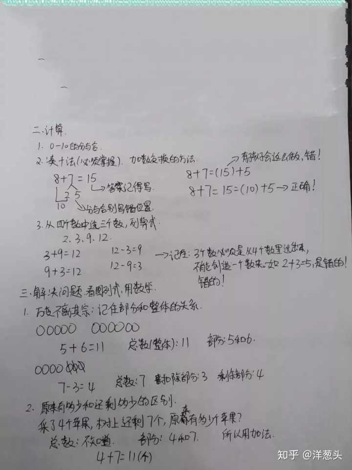
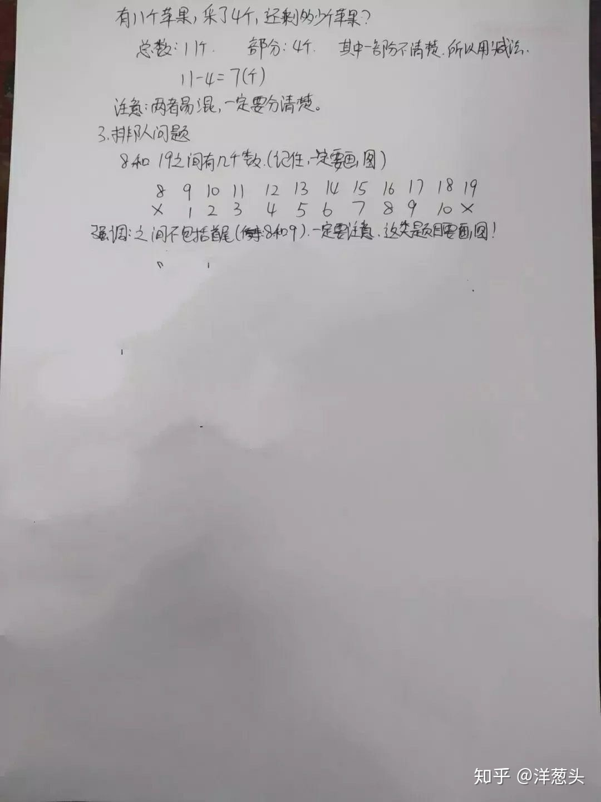
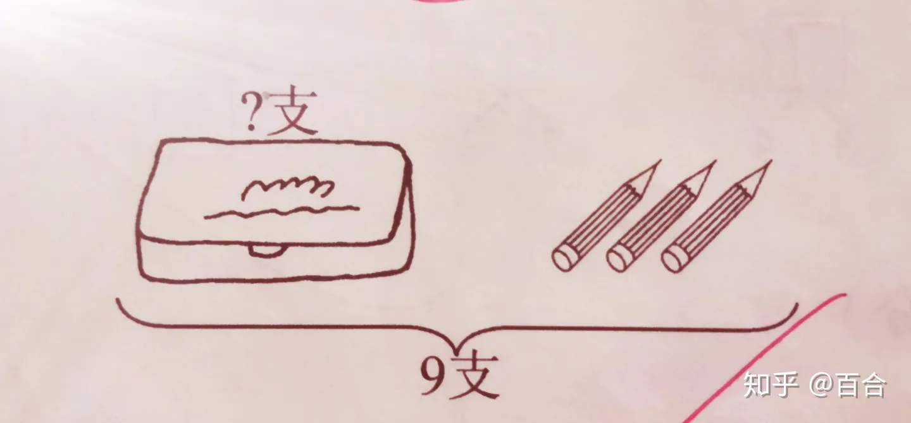

## 背景
大娃进入一年级学习已经三个多月了，最近在辅导孩子数学作业过程中碰到了不少问题，过程中经常把自己气的快爆炸忍不住大吼以及动手揍娃，事后看着孩子可怜的样子自己心里也不好受。认真反思了一下，觉得辅导孩子学习还是要讲究方法科学育儿，于是开一篇博文记录下互联网上其他人的经验以及自己的总结,希望能通过提升自己来提高孩子对数学的兴趣，更重要的是提高孩子的数学成绩以及改善亲子关系。

## 经验总结
### 知识点

### [人教版一年级上册数学知识点汇总](https://zhuanlan.zhihu.com/p/226100002)

### 大娃易错题
### 看图列减法算式
类似下图这样的:

我算了下给大娃在不同时间不同地方讲了至少 10 遍，讲完马上出道题给他练习，当场做对了，过了几天再出一题类似的又不会做了😔，无意中在知乎上面找到这位答主的答复，醍醐灌顶：[小学一年级数学题，娃怎么都不理解。问题出在哪里？ - 鑫妈辅娃记的回答 - 知乎](https://www.zhihu.com/question/308790516/answer/1602995113)

### 参考资料
[一年级学生学数学，这几点最重要](https://zhuanlan.zhihu.com/p/346786671)

[孩子刚上一年级，有必要大量刷题吗？](https://www.zhihu.com/question/425454658/answer/1535222952)

[如何教一年级的小孩数学，求技巧。? - 小学百科资料的回答 - 知乎](https://www.zhihu.com/question/21786505/answer/2119183920)