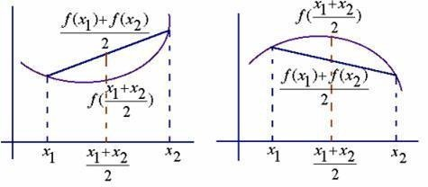

#### 目标函数，损失函数，代价函数

[机器学习中的目标函数、损失函数、代价函数有什么区别](https://www.zhihu.com/question/52398145)


#### 凸函数

- 同济大学高等数学定义

设 f(x) 在区间 I 上连续，如果对 I 上任意两点 x_1,x_2 ，恒有


那么称 f(x) 在 I 上的图形是（向上）凹的（或凹弧）；如果恒有


那么称 f(x) 在 I 上的图形是（向上）凸的（或凸弧）。

这个定义是直接从几何直观上得来的。如果在曲线弧上面任意取两点，连接这两点的弦总是在弧段的上方，那么曲线就是（向上）凹的，反之也有可类比的结论。取一个特殊的点，即弦的中点，曲线的凹凸性可以用弦的中点与曲线弧上具有相同坐标的点的位置关系来描述。



```comment
前人的工作已经保证了经典机器学习模型的目标函数都是凸函数。未来在应用中构建自己的目标函数，那么千万记得在直接应用任何优化算法之前，应该先确定它是凸函数。
```

#### 超参数
算法不能学习，需要人为设定的参数，就叫做超参数。