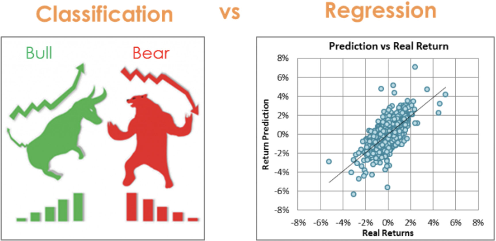
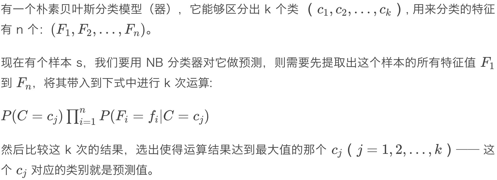

#### 分类 VS 回归

#### 分类模型 VS 回归模型

最根本的不同：前者是预测一个标签（类型、类别）；后者则是预测一个量。

换一个角度来看，分类模型输出的预测值是离散值；而回归模型输出的预测值则是连续值。

也就是说输入一个样本给模型，回归模型给出的预测结果是在某个值域（一般是实数域或其子集）上的任意值；而分类模型则是给出特定的某几个离散值之一。

#### [先验概率和后验概率](https://zhuanlan.zhihu.com/p/38567891)

- 先验概率（prior probability）：指根据以往经验和分析。在实验或采样前就可以得到的概率。

- 后验概率（posterior probability）：指某件事已经发生，想要计算这件事发生的原因是由某个因素引起的概率。

#### 贝叶斯公式

#### 一般化的贝叶斯公式

#### 简单的朴素贝叶斯分类器的模型函数

