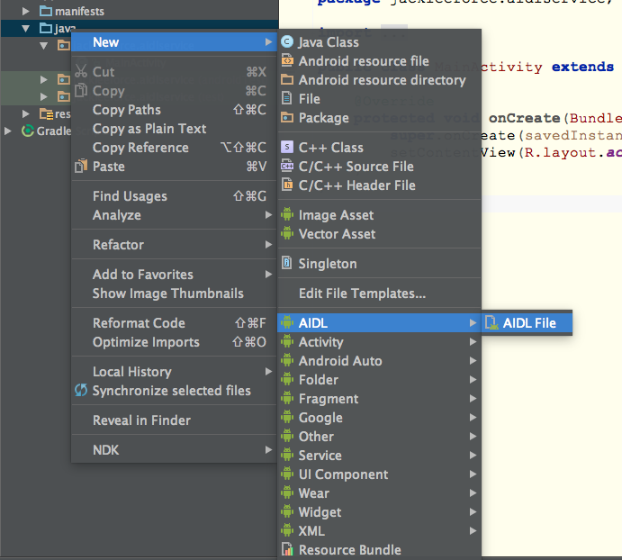
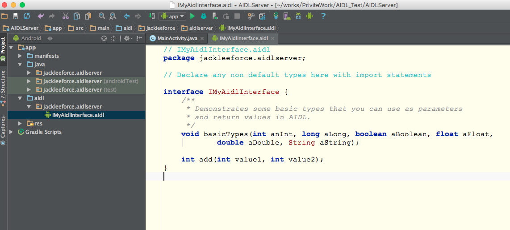
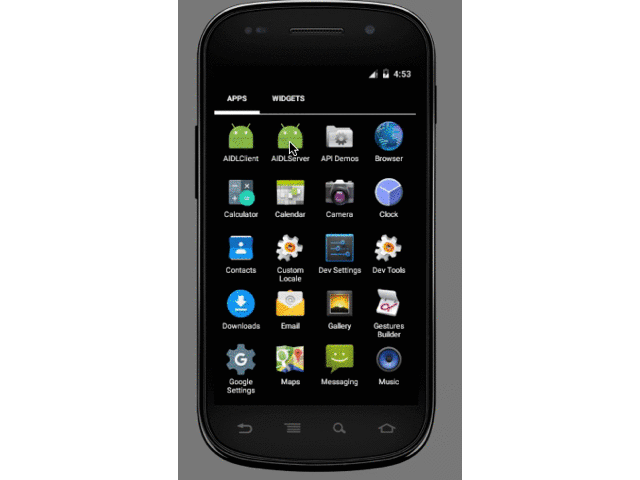

## 什么是AIDL？
AIDL是 Android Interface definition language的缩写，是Android的一种接口定义语言。通过它我们可以定义在Android上实现进程间通信的接口,在ADT和AS中会自动为我们写好的AIDL文件生成JAVA代码。
在Android中，为了实现进程间访问需要把复杂对象分解成操作系统可以理解的基本数据类型，在跨过进程边界后再组合成对象，实现组合成对象的代码单调又难于开发，好在Android为我们提供了AIDL处理这些功能。

## 什么场合下用AIDL？
直接看官方指南:https://developer.android.com/guide/components/aidl.html的这段话：

```
Note: Using AIDL is necessary only if you allow clients from different applications 
to access your service for IPC and want to handle multithreading in your service. 
If you do not need to perform concurrent IPC across different applications, you 
should create your interface by implementing a Binder or, if you want to perform 
IPC, but do not need to handle multithreading, implement your interface using a 
Messenger.
```
只有在你允许多个应用程序访问你提供的服务进行进程间通信，并且在提供的服务中涉及到多线程处理的时候才需要使用到AIDL。如果你无需处理多应用并发通信，你应该采用Binder进行进程间通信。如果你实现的进程间通信未涉及多线程处理，你需要采用Messenger进行进程间通信。
一般适用于为其它应用程序提供公共服务的Service，这种Service即为系统常驻的Service(如：天气服务，日历服务等)。

## 选择AIDL进行进程间通信有什么优缺点?
优点:
1.AIDL有自己的独立进程，不会受到其它进程的影响；
2.可以被其它进程复用，提供公共服务；
3.具有很高的灵活性。
4.相比Messenger,可以传输的数据量大。
缺点:
1.相对普通服务，占用系统资源较多，使用AIDL进行IPC也相对麻烦。

## AIDL如何使用？
既然用AIDL的最终目标是进行不同进程间通信，那这里咱们搞两个APP，一个Server,提供一个Service，用来对传入的参数做加法运算，另外一个Client,调用Server提供的Service。

### Server端实现
1.建立一个工程，命名:AIDLServer
2.新建AIDL文件,命名:IMyAidlInterface

3.生成后如图2，可以看到自动帮我们生成了一个函数basicTypes，示范了我们可以在AIDL里面使用的基本数据类型，这些类型可以当做参数或者函数返回值，这个函数我们没用到，不用理会，我们新增一个自己的函数add,AIDL文件创建到此结束。

4.我们前面提到过，ADT和AS会自动为我们写的AIDL文件生成JAVA代码，这篇文章里面我用的AS，我们点击，然后在app/build/generated/source/aidl/debug/包名下可以看到自动生成的IMyAidlInterface.java,不过实际上这个文件我们不会去动它。如图3：

5.创建Service提供服务，AIDL涉及到IPC通信，所以需要使用绑定服务,在这里我们创建了一个内部类MyAidlImpl继承我们前面写的IMyAidlInterface，并实现了add函数，然后在onBind函数里面返回匿名MyAidlImpl实例。


package jackleeforce.aidlserver;
import android.app.Service;
import android.content.Intent;
import android.os.IBinder;
import android.os.RemoteException;
import android.support.annotation.Nullable;

public class AIDLService extends Service
{

    public class MyAidlImpl extends IMyAidlInterface.Stub
    {
        @Override
        public int add(int value1, int value2) throws RemoteException {
            return value1 + value2;
        }
    
        @Override
        public void basicTypes(int anInt, long aLong, boolean aBoolean, float aFloat, double aDouble, String aString) throws RemoteException {
    
        }
    }
    
    @Nullable
    @Override
    public IBinder onBind(Intent intent) {
        return new MyAidlImpl();
    }
}


6.注册AIDLService,在AndroidManifest里面加入

<service android:name="jackleeforce.aidlserver.AIDLService"
            android:exported="true">
</service>


Server端口开发到此结束，实际上就三步，新增AIDL文件，然后创建绑定服务，在服务内实现我们要对外暴露的接口，然后注册服务，大家注意注册服务时我们写的name值，后面要用到，android:exported="true"表示导出这个服务接口。接下来我们实现客户端。

### Client端实现
1.建立一个工程，命名:AIDLClient
2.把刚才在AIDLServer工程里面建的IMyAidlInterface.aidl文件拷贝过来，这里注意包名，一定要跟Server端的一致，可以直接从AIDLServer文件夹里面连同AIDL目录一起拷过来，然后在AS里面刷新一下文件就出现了,如图4:

3.我们刚才在服务端定义了一个add计算两个数字和的接口，现在在客户端要使用这个接口，为了演示，这里做个简单计算器好了，MainActivity布局文件如下：


<?xml version="1.0" encoding="utf-8"?>
<LinearLayout xmlns:android="http://schemas.android.com/apk/res/android"
    xmlns:tools="http://schemas.android.com/tools"
    android:layout_width="match_parent"
    android:layout_height="match_parent"
    android:padding="16dp"
    tools:context=".MainActivity">

    <EditText
        android:id="@+id/et_a"
        android:layout_width="0dp"
        android:layout_height="wrap_content"
        android:layout_weight="1"
        android:inputType="number"
        android:gravity="center_horizontal" />
    
    <TextView
        android:layout_width="wrap_content"
        android:layout_height="wrap_content"
        android:text="+" />
    
    <EditText
        android:id="@+id/et_b"
        android:layout_width="0dp"
        android:layout_height="wrap_content"
        android:layout_weight="1"
        android:inputType="number"
        android:gravity="center_horizontal" />
    
    <TextView
        android:layout_width="wrap_content"
        android:layout_height="wrap_content"
        android:text="=" />
    
    <EditText
        android:id="@+id/et_result"
        android:layout_width="wrap_content"
        android:layout_height="wrap_content"
        android:layout_weight="1"
        android:enabled="false"
        android:gravity="center_horizontal" />
    
    <Button
        android:id="@+id/calculate"
        android:layout_width="0dp"
        android:layout_height="wrap_content"
        android:layout_weight="1"
        android:onClick="onCalculate"
        android:text="计算" />
</LinearLayout>


MainActivity.java代码如下：


package jackleeforce.aidlclient;

import android.content.ComponentName;
import android.content.Context;
import android.content.Intent;
import android.content.ServiceConnection;
import android.os.IBinder;
import android.os.RemoteException;
import android.support.v7.app.AppCompatActivity;
import android.os.Bundle;
import android.view.View;
import android.widget.Button;
import android.widget.EditText;
import android.widget.Toast;
import jackleeforce.aidlserver.IMyAidlInterface;


public class MainActivity extends AppCompatActivity implements View.OnClickListener {

    private EditText et_a;
    private EditText et_b;
    private EditText et_result;
    private Button btn_calc;
    private IMyAidlInterface mService;
    private AddServiceConnect mServiceConnect;
    
    @Override
    protected void onCreate(Bundle savedInstanceState) {
        super.onCreate(savedInstanceState);
        setContentView(R.layout.activity_main);
    
        initUI();
    
        connectService();
    
    }
    
    @Override
    protected void onDestroy() {
        super.onDestroy();
    
        releaseService();
    }
    
    private void initUI()
    {
        et_a = (EditText)findViewById(R.id.et_a);
        et_b = (EditText)findViewById(R.id.et_b);
        et_result = (EditText)findViewById(R.id.et_result);
        btn_calc = (Button)findViewById(R.id.calculate);
    
        btn_calc.setOnClickListener(this);
    }
    
    @Override
    public void onClick(View v) {
        switch (v.getId())
        {
            case R.id.calculate:
                calc();
                break;
            default:
                break;
    
        }
    }
    
    private void calc()
    {
        int a = Integer.parseInt(et_a.getText().toString());
        int b = Integer.parseInt(et_b.getText().toString());
    
        try
        {
            int result = mService.add(a, b);
    
            et_result.setText(String.valueOf(result));
        }
        catch (Exception e)
        {
            e.printStackTrace();
        }
    }
    
    class AddServiceConnect implements ServiceConnection
    {
        @Override
        public void onServiceConnected(ComponentName name, IBinder service) {
            mService = IMyAidlInterface.Stub.asInterface(service);
    
            Toast.makeText(MainActivity.this,"onServiceConnected",Toast.LENGTH_LONG).show();
        }
    
        @Override
        public void onServiceDisconnected(ComponentName name) {
            mService = null;
    
            Toast.makeText(MainActivity.this,"onServiceDisconnected",Toast.LENGTH_LONG).show();
        }
    }
    
    public void connectService()
    {
        mServiceConnect = new AddServiceConnect();
        Intent i = new Intent();
    
        i.setComponent(new ComponentName("jackleeforce.aidlserver","jackleeforce.aidlserver.AIDLService"));
        i.setPackage(getPackageName());
    
        boolean result = getApplicationContext().bindService(i,mServiceConnect, Context.BIND_AUTO_CREATE);
        if (!result)
        {
            Toast.makeText(MainActivity.this,"bindService failed",Toast.LENGTH_LONG).show();
        }
    }
    
    public void releaseService()
    {
        unbindService(mServiceConnect);
        mServiceConnect = null;
    }
}


可以看到MainActivity起来的时候调用我们实现的connectService去连接服务端提供的服务，咱们看一下上面的connectService函数，第104行创建一个AddServiceConnect对象，从85行可以看到AddServiceConnect是一个内部类，实现了ServiceConnection接口，一看重载的两个方法名字就能明白，这是一个回调接口，当服务成功连接上了会调用onServiceConnected方法，89行我在onServiceConnected方法中，将返回的Binder对象转换成AIDL接口，以后就可以通过这个AIDL接口去调用服务端暴露出来的Service（在服务端实现的add）。当服务端因异常或者主动断开后，会执行onServiceDisConnected方法，表示已经断开连接。
接下来再回到connectService函数，第105行创建了一个Intent对象，接下来107和108两行代码非常关键，可以说是一个大坑，照着网络上大部分博文学习AIDL，最后无法成功绑定服务就是因为写错，107行设置Intent对象的ComponentName，第一个参数服务端的包名，第二个参数服务端暴露的Service名字,也就是前面实现服务端代码时在AndroidManifest里面注册的Service Name，这里是jackleeforce.aidlserver.AIDLService，由于Andorid 5.0以后不允许使用匿名Intent对象，这里在108行通过setPackage方法设置包名。然后在110行通过bindService函数去绑定服务。

到这里我们Server端与Client端代码都实现完成了，这里总结一下：
服务端
1.定义AIDL文件。
2.定义要暴露的的Service，并在里面实现AIDL文件中声明的方法。
3.注册Service，明确Service Name，并将Service声明成Export。

客户端
1.引入AIDL文件。
2.通过bindService函数去绑定服务端暴露的Service,系统会通过我们指定的Service Name找到这个Service，成功连接了以后会返回一个Binder对象，我们要用Stub.asInterface将这个Binder对象转换成我们需要的AIDL对象，这个AIDL对象的类实现代码就是系统自动为我们引入的AIDL文件生成的JAVA文件。
3.有了AIDL对象，我们就可以调用里面暴露的接口了。

分别编译运行AIDLServer与AIDLClient,我这里实现的例子中要先运行AIDLServer与AIDLClient，效果如图：


以上就是AIDL的基本使用知识，接下来我将专门写一篇文章讲诉如何通过AIDL传递复杂对象，并通过AIDL模拟实现QQ社交登陆SDK。

本文中的两个工程例子在此：https://github.com/lijiahua/AIDL_Test


