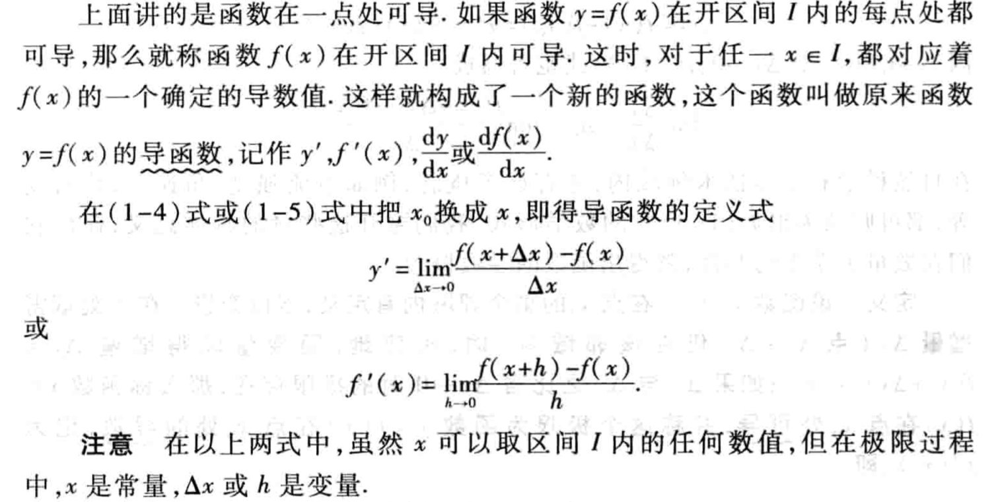
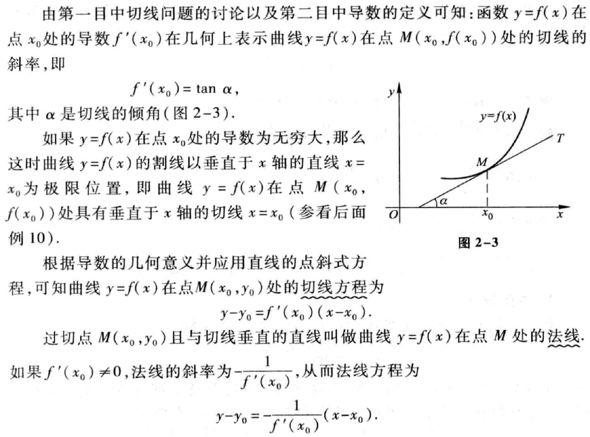
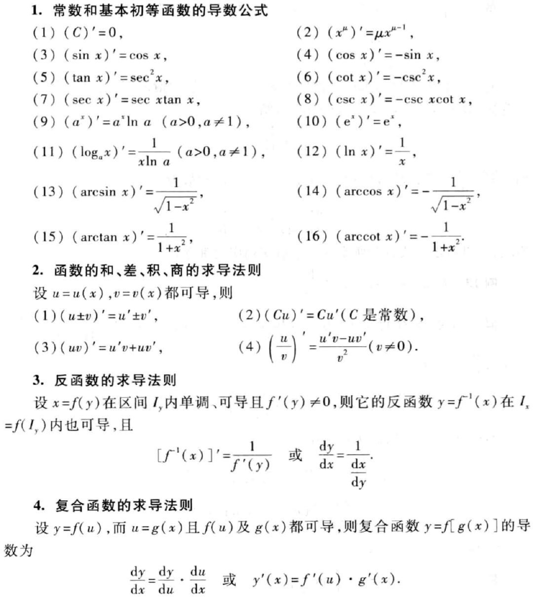
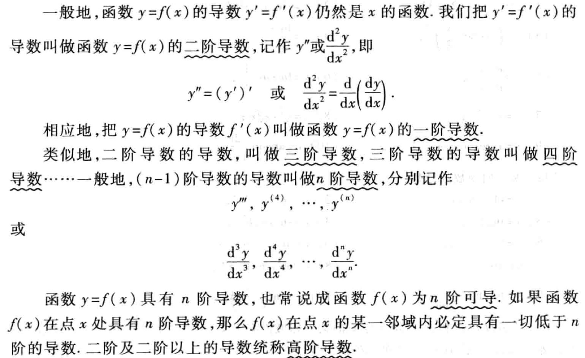
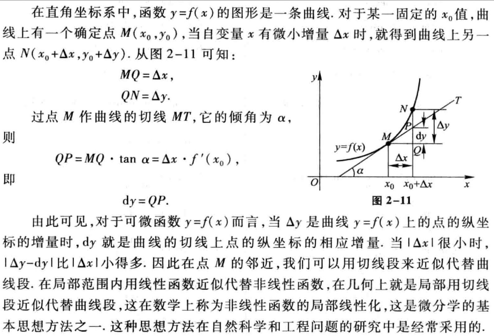
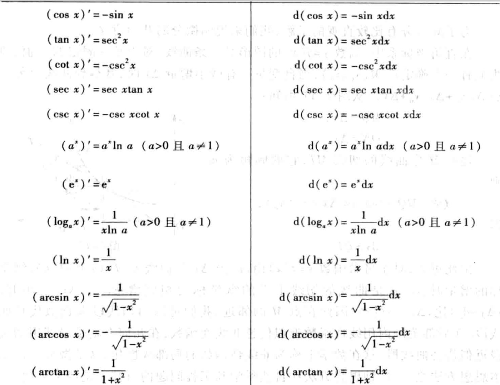

# 导数与微分

## 导数

### 导函数

### 特殊函数的导数公式

#### 幂函数的导数公式

幂函数f(x) = xn (n ϵ R ) 的导数公式：

(xn)' = nxn-1

#### 三角函数的导数公式

- 正弦函数 f(x) = sin x  的导数公式

    * (sin x)' = cos x

    即正弦函数的导数是余弦函数。

- 余弦函数 f(x) = cos x  的导数公式：

    * (cos x)' = -sina x

    即余弦函数的导数是负的正弦函数。

- 正切函数 f(x) = tan x 的导数公式：

    * (tan x)' = sec2x

- 余切函数 f(x) = cot x 的导数公式：

    * (cot x)' = - csc2x 

- 正割函数 f(x) = sec x 的导数公式：

    * (sec x)' = sec x \* tan x

- 余割函数 f(x) = csc x 的导数公式：

    * (csc x)' = - csc x \* cot x

- 反正弦函数 f(x) = arcsinx x 的导数公式：

- 反余弦函数 f(x) = arccos x 的导数公式：

- 反正切函数 f(x) = arctan x 的导数公式：

- 反余切函数 f(x) = arccot x 的导数公式：

#### 指数函数的导数公式

指数函数f(x) = ax (a>0,a≠1)的导数公式:

#### 对数函数的导数公式

对数函数f(x) = logax (a>0,a≠1)的导数公式:

### 导数的几何意义

### 求导法则

#### 函数的和，差，积，商的求导法则

#### 反函数的求导法则

* 即反函数的导数等于直接函数导数的倒数。

#### 复合函数的求导法则

### 基本初等函数的导数公式总结：

### 高阶导数

## 微分

### 微分的几何意义

### 基本初等函数的微分公式

### 函数和，差，积，商的积分法则

### 复合函数的微分法则

